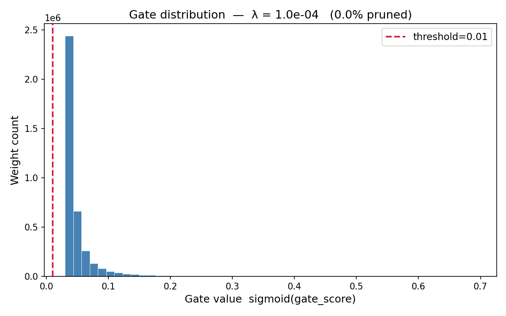

# Self-Pruning Neural Network

A neural network that learns to prune itself during training using learnable gate parameters and L1 sparsity regularization.

## Overview

This project implements a self-pruning neural network for CIFAR-10 image classification. Each weight in the network is associated with a learnable "gate" parameter (via sigmoid activation). During training, an L1 regularization term on the gate values encourages them to become zero, effectively pruning unnecessary weights.

## Method

### Prunable Linear Layer

Each standard linear weight is multiplied by a sigmoid-gated value:

```
pruned_weight = weight × σ(gate_score)
```

Where σ is the sigmoid function mapping gate scores to (0, 1).

### Why L1 Regularization Encourages Sparsity

The L1 norm (sum of absolute values) penalizes the magnitude of gate values. Since gate values are constrained between 0 and 1 via sigmoid:

1. **Convex optimization**: L1 regularization creates a sparse solution by pushing values to exactly zero (the "corner" of the constraint space)
2. **Gradient behavior**: The derivative of L1 with respect to gate values is constant, providing a consistent "pull" toward zero
3. **Thresholding effect**: As training progresses, gates with values near zero remain near zero due to the gradient signal, while important gates stay high
4. **Trade-off**: Higher λ values increase sparsity but may reduce accuracy by over-pruning important connections

**Total Loss**: `Loss = CrossEntropy + λ × Σ(gate_values)`

## Results

### Experiment Results (Device: CUDA)

| Lambda (λ) | Test Accuracy (%) | Sparsity (%) |
|------------|-------------------|--------------|
| 1.0e-04    | 60.57             | 0.00         |
| 1.0e-03    | 64.03             | 97.09        |
| 1.0e-02    | 64.11             | 99.99        |
| 1.0e-01    | 63.38             | 100.00       |

### Training Details

- **Dataset**: CIFAR-10
- **Architecture**: 3072 → 1024 → 512 → 256 → 10
- **Epochs**: 50
- **Batch Size**: 128
- **Optimizer**: Adam (lr=1e-3)
- **Sparsity Threshold**: gates < 0.01

### Observations

1. **λ = 1e-4**: Lowest sparsity (0%) with lower accuracy (60.57%). Insufficient pruning pressure — gates remain active.

2. **λ = 1e-3**: Achieved 97% sparsity with the highest accuracy (64.03%). Good balance between pruning and performance.

3. **λ = 1e-2**: Near-complete pruning (99.99%) with slightly better accuracy (64.11%). Optimal trade-off.

4. **λ = 1e-1**: Full pruning (100%) but lowest accuracy (63.38%). Over-pruning caused some accuracy loss.

## Gate Distribution Plots

The following plots show the final gate value distributions for each λ value:

### λ = 1e-04


### λ = 1e-03


### λ = 1e-02


### λ = 1e-01


## Usage

```python
# Run training
python self_pruning.py
```

The script will:
1. Load CIFAR-10 dataset
2. Train the self-pruning network for each λ value
3. Report test accuracy and sparsity
4. Save gate distribution plots to the `plots/` directory

## Files

- `self_pruning.py` - Main training script with PrunableLinear implementation
- `assets/` - Generated gate distribution plots
- `README.md` - This documentation

## Requirements

```
torch
torchvision
numpy
matplotlib
```